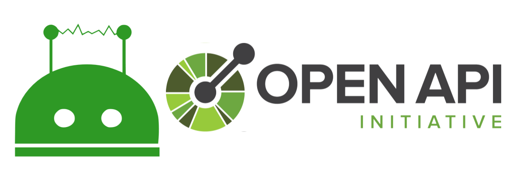
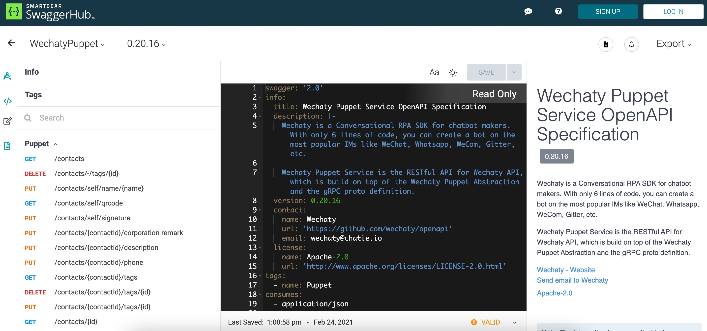

<div align="center">

<br />
<h1>Wechaty Puppet OpenAPI Specification (OAS)</h1>
<p>
Wechaty REST API Server with OpenAPI Specification (Swagger)
</p>
<a href="https://github.com/wechaty/openapi/issues
"></a>
<a href="https://github.com/wechaty/openapi/network/members"></a>
<a href="https://github.com/wechaty/openapi/stargazers"></a>
<a href="https://github.com/wechaty/openapi/blob/master/LICENSE"></a>
</div>

<div align="center">

</div>

<details open="open">
<summary>Table of Contents</summary>
<ol>
<li><a href="#About">About</a></li>
<li><a href="#Motivation">Motivation</a></li>
<li><a href="#Screenshots">Screenshots</a></li>
<li><a href="#Features">Features</a></li>
<li><a href="#Install">Install</a></li>
<li>
<a href="#Usage">Usage</a></li>
<ul>
<li><a href="#1-Standalone-Server">Standalone Server</a></li>
<li><a href="#2-Express-Router">Express Router</a></li>
</li>
</ul>
<li><a href="#Architecture">Architecture</a></li>
<li><a href="#Resources">Resources</a></li>
<li><a href="#Contributing">Contributing</a></li>
<li><a href="#Author">Author</a></li>
<li><a href="#Copyright--License">Copyright & License</a></li>
</ol>

## About

**OpenAPI Specification** (formerly Swagger Specification) is an API description format for REST APIs. An OpenAPI file allows you to describe your entire API, including:

- Available endpoints (`/users`) and operations on each endpoint (`GET /users`, `POST /users`)
- Operation parameters Input and output for each operation
- Authentication methods
- Contact information, license, terms of use, and other information.

API specifications can be written in YAML or JSON. The format is easy to learn and readable to both humans and machines. The complete OpenAPI Specification can be found on GitHub: [OpenAPI 3.0 Specification](https://github.com/OAI/OpenAPI-Specification/blob/master/versions/3.0.2.md)

**NOTE:**

> This repo is working in the process.
> We hope we can finish an alpha version in April,
> and be ready to Beta in May!

> Issues & PRs are welcome, thank you very much for your attention.

## Motivation

We have [gRPC](https://github.com/wechaty/openapi) for [Wechaty Puppet](https://github.com/wechaty/wechaty-puppet), and we want a RESTful API as well, so we built [OpenAPI Specification](https://www.openapis.org/) (OAS, former [Swagger](https://swagger.io/)) on top of gRPC, with the power of [gRPC OAS Gateway](https://github.com/grpc-ecosystem/grpc-gateway).

## Screenshots

<div align="center">

</div>

<br />

> [View Wechaty OpenAPI Specification on SwaggerHub](https://app.swaggerhub.com/apis/zixia/WechatyPuppet/)

## Features

1. A **Standalone HTTP Server** `wechaty-openapi-server`
2. An **Express Router** for easy mounting to any existing **Express HTTP Server**.

## Install

```sh
npm install wechaty-openapi
```

## Usage

#### 1. Standalone Server

```sh
export WECHATY_PUPPET_SERVICE_TOKEN=__YOUR_TOKEN__
wechaty-openapi-server \
  --mountpoint /api
  --port 8080
```

Then visit <http://localhost:8080/api>

#### 2. Express Router

> TBW

## Architecture

Thanks to the ecosystem of gRPC, we can generate OpenAPI Specification from our gRPC proto definitions automatically.

We are using [gRPC to JSON proxy generator following the gRPC HTTP spec](https://github.com/grpc-ecosystem/grpc-gateway) as the OpenAPI Specification generator ([protoc-gen-openapiv2](https://github.com/grpc-ecosystem/grpc-gateway/tree/master/protoc-gen-openapiv2)), and using [Like grpc-gateway, but written in node and dynamic](https://github.com/konsumer/grpc-dynamic-gateway) project to serve an HTTP RESTful API to gRPC proxy.

<div align="center"><a link="https://github.com/wechaty/openapi"><a></div>

> Image credit: [gRPC Gateway](https://grpc-ecosystem.github.io/grpc-gateway/)

Learn more about the RESTful API service for Wechaty from [Wechaty OpenAPI](https://github.com/wechaty/openapi).

See also: [AIP-4222 - Routing headers](https://google.aip.dev/client-libraries/4222)

## Resources

Read blogs with the `openapi` tag at https://wechaty.js.org/tags.html#openapi.

Check out [RESOURCES.md](RESOURCES.md) file for learning resources.

## Contributing

Contributions are what make the open-source community such an amazing place to learn, inspire, and create. Any contributions you make are **greatly appreciated**.

1. Fork the Project
2. Create your Feature Branch (`git checkout -b feature/AmazingFeature`)
3. Commit your Changes (`git commit -m 'Add some AmazingFeature'`)
4. Push to the Branch (`git push origin feature/AmazingFeature`)
5. Open a Pull Request

See [CONTRIBUTING.md](http://github.com/wechaty/openapi/blob/master/CONTRIBUTING.md) for more details.

## Author

[Huan LI](https://github.com/huan)
([李卓桓](http://linkedin.com/in/zixia)),
[Microsoft Regional Director](https://rd.microsoft.com/en-us/huan-li),
\<zixia@zixia.net\>

[](https://stackexchange.com/users/265499)

## Copyright & License

- Code & Docs © 2018-now Huan LI \<zixia@zixia.net\>
- Wechaty gRPC is licensed under the BSD Apache License. See [LICENSE](https://github.com/wechaty/openapi/blob/master/LICENSE) for more details.
- Docs released under Creative Commons
