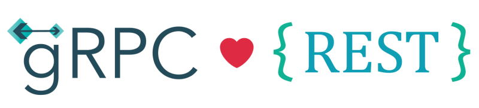

# Wechaty Puppet OpenAPI Specification (OAS)

> Image credit: [Introducing gRPC HTTP API](http://james.newtonking.com/archive/2020/03/31/introducing-grpc-http-api)

## Motivation

We have [gRPC](https://github.com/wechaty/grpc) for [Wechaty Puppet](https://github.com/wechaty/wechaty-puppet), and we want a RESTful API as well, so we built [OpenAPI Specification](https://www.openapis.org/) (OAS, former [Swagger](https://swagger.io/)) on top of gRPC, with the power of [gRPC OAS Gateway](https://github.com/grpc-ecosystem/grpc-gateway).

## Resources

- Talk video: [Writing REST Services for the gRPC curious, Johan Brandhorst, 2019, GopherCon UK](https://youtu.be/Pq1paKC-fXk)

## History

### master

### v0.0.1 (Feb 1, 2021)

TODO

## Author

[Huan LI](https://github.com/huan) ([李卓桓](http://linkedin.com/in/zixia)),
Tencent TVP of Chatbot, \<zixia@zixia.net\>

## Copyright & License

- Code & Docs © 2021-now Huan LI \<zixia@zixia.net\>
- Code released under the Apache-2.0 License
- Docs released under Creative Commons
