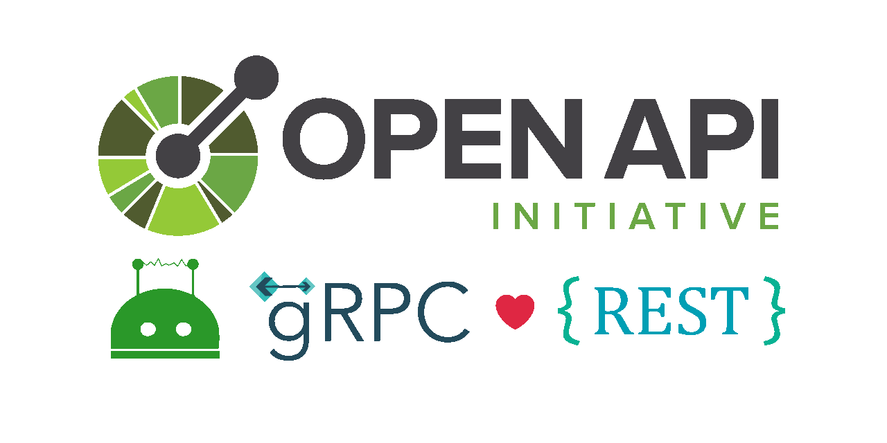
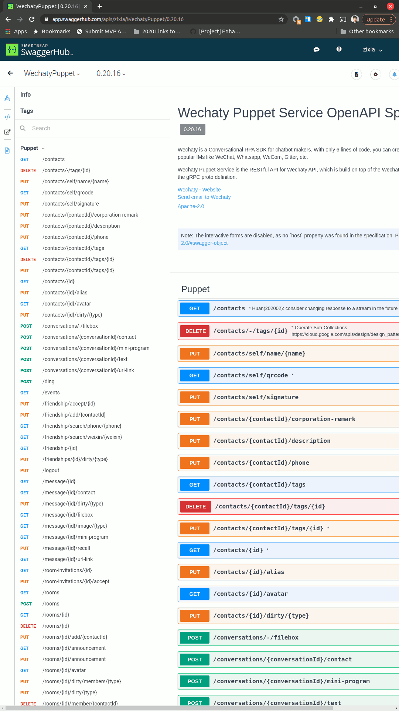

# Wechaty Puppet OpenAPI Specification (OAS)



> Image credit: [Introducing gRPC HTTP API](http://james.newtonking.com/archive/2020/03/31/introducing-grpc-http-api)

## UNDER CONSTRUCTION

This repo is working in the process.
We hope we can finish an alpha version in April,
and be ready to Beta in May!

Issues & PRs are welcome, thank you very much for your attention.

## MOTIVATION

We have [gRPC](https://github.com/wechaty/grpc) for [Wechaty Puppet](https://github.com/wechaty/wechaty-puppet), and we want a RESTful API as well, so we built [OpenAPI Specification](https://www.openapis.org/) (OAS, former [Swagger](https://swagger.io/)) on top of gRPC, with the power of [gRPC OAS Gateway](https://github.com/grpc-ecosystem/grpc-gateway).

## SCREENSHOT



> [View Wechaty OpenAPI Specification on SwaggerHub](https://app.swaggerhub.com/apis/zixia/WechatyPuppet/)

## FEATURES

1. A **Standalone HTTP Server** `wechaty-openapi-server`
2. An **Express Router** for easy mounting to any existing **Express HTTP Server**.

## INSTALL

```sh
npm install wechaty-openapi
```

## USAGE

### 1. Standalone Server

```sh
export WECHATY_PUPPET_SERVICE_TOKEN=__YOUR_TOKEN__
wechaty-openapi-server \
 --mountpoint /api
 --port 8080
```

Then visit <http://localhost:8080/api>

### 2. Express Router

tbw

## KNOWN ISSUES

- [Upload file via auto-generated OpenAPI specification with gRPC backend #1](https://github.com/wechaty/openapi/issues/1)

## ARCHITECTURE

[](https://grpc-ecosystem.github.io/grpc-gateway/)

> Image credit: [grpc-gateway](https://grpc-ecosystem.github.io/grpc-gateway/)

Thanks to the ecosystem of gRPC, we can generate OpenAPI Specification from our gRPC proto definitions automatically.

We are using [gRPC to JSON proxy generator following the gRPC HTTP spec](https://github.com/grpc-ecosystem/grpc-gateway) as the OpenAPI Specification generator ([protoc-gen-openapiv2](https://github.com/grpc-ecosystem/grpc-gateway/tree/master/protoc-gen-openapiv2)), and using [Like grpc-gateway, but written in node and dynamic](https://github.com/konsumer/grpc-dynamic-gateway) project to serve an HTTP RESTful API to gRPC proxy.

## RESOURCES

- [OpenAPI Specification v3.1](https://github.com/OAI/OpenAPI-Specification/blob/master/versions/3.1.0.md)
- [gRPC with REST and Open APIs](https://grpc.io/blog/coreos/)

### gRPC Transcoding

- [Google Cloud: Transcoding HTTP/JSON to gRPC](https://cloud.google.com/endpoints/docs/grpc/transcoding)
- [Envoy: gRPC-JSON transcoder](https://www.envoyproxy.io/docs/envoy/latest/configuration/http/http_filters/grpc_json_transcoder_filter)

### RESTful API Naming Convention

- [REST Resource Naming Guide](https://restfulapi.net/resource-naming/)
- [10+ Best Practices for Naming API Endpoints](https://nordicapis.com/10-best-practices-for-naming-api-endpoints/)
- [PUT vs. POST in REST](https://stackoverflow.com/a/2590281/1123955)
- [Google Cloud Common Design Patterns](https://cloud.google.com/apis/design/design_patterns)
- [REST based Services/Architecture vs. RESTFUL Services/Architecture](https://stackoverflow.com/a/24584128/1123955)

### Tutorials

- Talk video: [Writing REST Services for the gRPC curious, Johan Brandhorst, 2019, GopherCon UK](https://youtu.be/Pq1paKC-fXk)
- [Take a REST with HTTP/2, Protobufs, and Swagger](https://coreos.com/blog/grpc-protobufs-swagger.html)
- [All the boilerplate you need to get started with writing grpc-gateway powered REST services in Go](https://github.com/johanbrandhorst/grpc-gateway-boilerplate)

## AUTHOR

[Huan LI](https://github.com/huan)
([李卓桓](http://linkedin.com/in/zixia)),
[Microsoft Regional Director](https://rd.microsoft.com/en-us/huan-li),
\<zixia@zixia.net\>

[](https://stackexchange.com/users/265499)

## COPYRIGHT & LICENSE

- Code & Docs © 2021-now Huan LI \<zixia@zixia.net\>
- Code released under the Apache-2.0 License
- Docs released under Creative Commons
